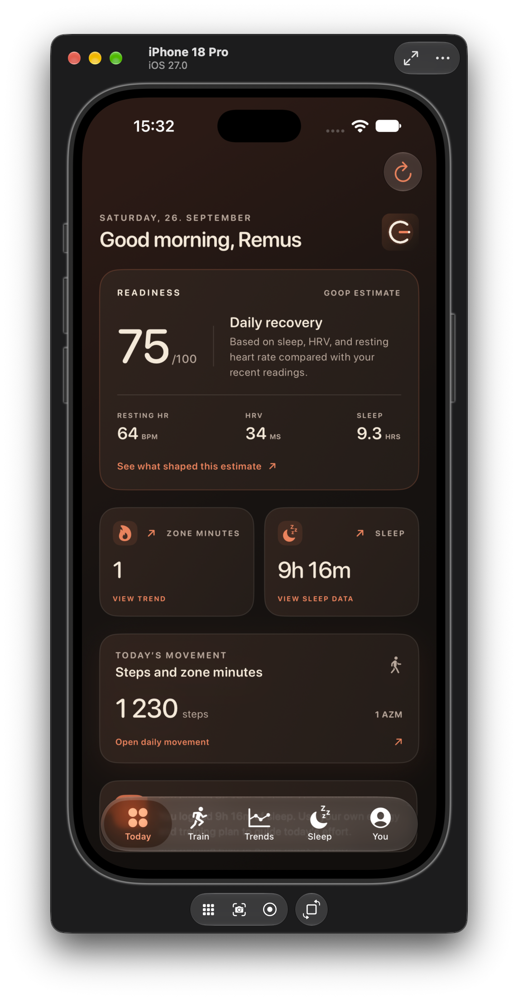
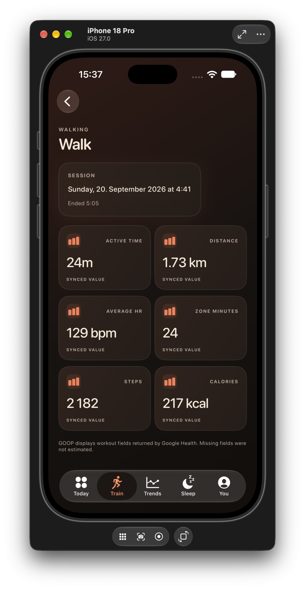
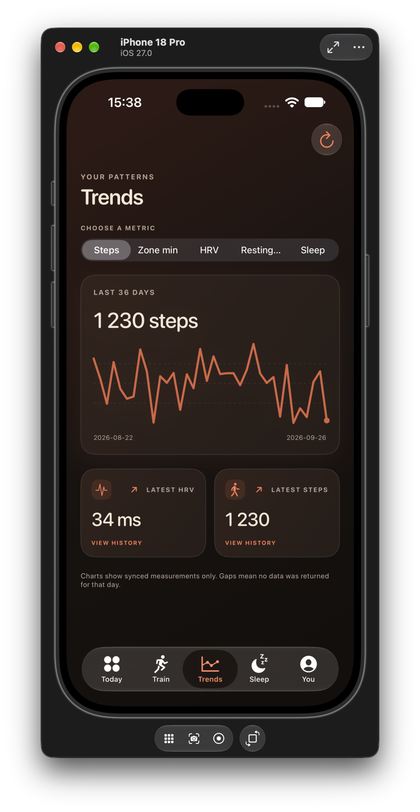
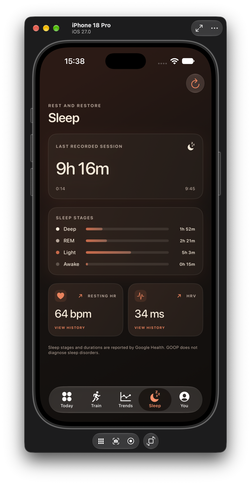
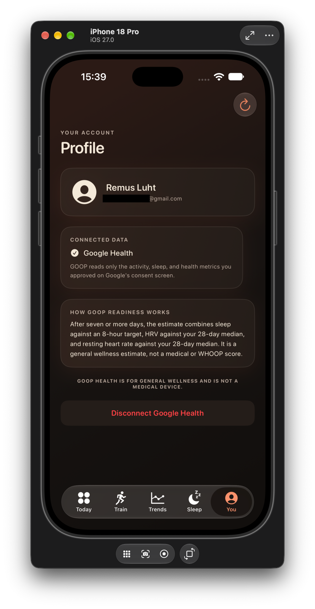

# GOOP

GOOP is a small iPhone app for checking Fitbit health data that has synced to Google Health. It puts daily movement, sleep, workouts, trends, and a simple readiness estimate in one place.

I built it for personal use. It is not WHOOP, it does not use WHOOP's private Strain or Recovery algorithms, and its readiness number is a general wellness estimate rather than medical advice. If Google Health has not received a reading from your device, GOOP leaves that field empty.

## A look around

| Today | Train | Trends |
| --- | --- | --- |
|  |  |  |

| Sleep | Profile |
| --- | --- |
|  |  |

## What you need

- A Mac with Xcode. This project currently targets iOS 27.0, so use an Xcode version and iPhone that support that target.
- A Google Cloud project with the Google Health API enabled.
- A Railway account for the small server that handles Google sign-in and requests health data.
- A private GitHub repository if you want Railway to deploy from GitHub.

For your own iPhone, you can install a build directly from Xcode with a free Apple Account. TestFlight distribution requires Apple Developer Program membership. [Apple's membership comparison](https://developer.apple.com/support/compare-memberships/) lays out the difference.

## How the pieces fit together

The iPhone app sends you through Google's sign-in page, then asks the GOOP server for your synced health information. The server keeps the Google client secret and the refresh token; the iOS app never contains the client secret. The server is configured to accept only the email address in `GOOP_ALLOWED_EMAIL`.

Google Health can only return data that your Fitbit device has synced and that you approved on Google's consent screen. The app currently displays activity, sleep, health metrics, workouts, history, and a GOOP readiness estimate. The estimate needs at least seven earlier days of HRV and resting heart-rate readings, plus today's sleep and readings, before it appears.

## Set up Google sign-in

1. Open [Google Cloud Console](https://console.cloud.google.com/) and create a project for GOOP, or choose an existing one.
2. Enable **Google Health API** for the project. Google's [setup guide](https://developers.google.com/health/setup) has screenshots and the latest console steps.
3. In **Google Auth Platform → Audience**, set the audience to **External** and add your Google account as a test user. Use this same email for `GOOP_ALLOWED_EMAIL` later.
4. In **Google Auth Platform → Data Access**, allow the scopes the app uses:
   - `openid`, `email`, and `profile`
   - `https://www.googleapis.com/auth/googlehealth.activity_and_fitness.readonly`
   - `https://www.googleapis.com/auth/googlehealth.sleep.readonly`
   - `https://www.googleapis.com/auth/googlehealth.health_metrics_and_measurements.readonly`
5. Create an OAuth client ID with application type **Web application**. You will add the redirect URI after Railway gives you a public domain.

The Google consent screen may warn that GOOP is unverified while it is in Testing. That is expected for a personal project. Google currently expires authorizations and refresh tokens for apps in Testing after seven days when they request these health-data scopes, so you may have to sign in again weekly. Moving the app to Production is not a shortcut around Google's review requirements; see Google's [testing-mode details](https://support.google.com/cloud/answer/15549945?hl=en) and [Google Health OAuth setup](https://developers.google.com/health/setup).

## Deploy the server to Railway

The Xcode project and backend live in this repository. Railway should build from the `server` folder.

1. Use a **private** GitHub repository for the project. From the `GOOP` repository folder, save and push the current changes:

   ```sh
   git add -A
   git commit -m "Update GOOP setup guide"
   git remote -v
   git push -u origin main
   ```

   If `git remote -v` shows the wrong GitHub repository, update it with `git remote set-url origin https://github.com/YOUR-NAME/YOUR-PRIVATE-REPO.git` before pushing. If there is no `origin` yet, add one with `git remote add origin https://github.com/YOUR-NAME/YOUR-PRIVATE-REPO.git`. `server/.env` is ignored by Git; keep it that way and never upload your client secret or generated keys.

2. In [Railway](https://railway.com/), create a project and deploy from your GitHub repository.
3. In the new service's **Settings**, set the **Root Directory** to `/server`. The service uses Node.js 20 or newer and starts with `npm start`.
4. In **Networking**, generate a Railway domain. Copy the HTTPS address Railway gives you, for example `https://your-goop-service.up.railway.app`.
5. Go back to Google Cloud, open the Web application OAuth client, and add this exact **Authorized redirect URI**:

   ```text
   https://your-goop-service.up.railway.app/auth/google/callback
   ```

   Replace the example host with your Railway domain. The URI must match `GOOGLE_REDIRECT_URI` exactly, including the path.

6. In Railway's service **Variables**, add the following. For the two random values, open Terminal on your Mac and run each command once:

   ```sh
   openssl rand -base64 32
   openssl rand -hex 32
   ```

   Put the first output in `GOOP_TOKEN_ENCRYPTION_KEY` and the second in `GOOP_SESSION_PEPPER`.

   | Variable | Value |
   | --- | --- |
   | `GOOGLE_CLIENT_ID` | Client ID from your Google Web application OAuth client |
   | `GOOGLE_CLIENT_SECRET` | Client secret from that same OAuth client |
   | `GOOGLE_REDIRECT_URI` | `https://your-goop-service.up.railway.app/auth/google/callback` |
   | `GOOP_ALLOWED_EMAIL` | The exact Google email you added as a test user |
   | `GOOP_TOKEN_ENCRYPTION_KEY` | Output of `openssl rand -base64 32` |
   | `GOOP_SESSION_PEPPER` | Output of `openssl rand -hex 32` |
   | `GOOP_DATA_FILE` | `/data/store.json` |
   | `IOS_CALLBACK_URI` | `goop://auth/callback` |

   Railway sets `PORT` for the app. Leave it alone.

7. Add a Railway **Volume** to the service and set its mount path to `/data`. The server stores the encrypted Google token there. Without the volume, a redeploy or restart can erase the saved connection. Railway explains this in its [Volumes guide](https://docs.railway.com/volumes).
8. In Railway's deployment settings, set the health-check path to `/healthz`. Keep the service at **one replica**: the short-lived OAuth sign-in state is kept in server memory during login.
9. Deploy the service. Open `https://your-goop-service.up.railway.app/healthz` in a browser. A working service responds with `{"ok":true}`.

Keep the two generated keys somewhere safe. Do not rotate `GOOP_TOKEN_ENCRYPTION_KEY` after signing in: the server needs the same key to decrypt the saved Google refresh token. Railway's [domain guide](https://docs.railway.com/networking/domains/working-with-domains) explains generated domains and HTTPS.

## Install GOOP on your iPhone

1. Open `GOOP.xcodeproj` in Xcode.
2. In Xcode, open the **GOOP** project and select the **GOOP** app target.
3. Under **Signing & Capabilities**, choose your Apple Account's **Personal Team**. If Xcode asks, sign in from **Xcode → Settings → Accounts**. Xcode may ask you to change the bundle identifier to a unique value for your team; accept the suggested change.
4. Select the **GOOP** target's **Build Settings** tab and search for `GOOP_API_BASE_URL`. Set both **Debug** and **Release** to your Railway HTTPS address, without a trailing slash. The current project setting points to the existing GOOP Railway service; replace it if you made a new one.
5. Connect your iPhone to your Mac, select it as the run destination in Xcode, and press the **Run** button. On first use, accept the trust and Developer Mode prompts on the iPhone if they appear. You can pair the phone wirelessly from Xcode after it has been connected once.
6. When GOOP opens, tap **Continue with Google**, choose the email you added as the test user, and approve the requested health permissions.
7. Sync your Fitbit with Google Health, then pull down in GOOP to refresh.

The Google client secret belongs only in Railway's Variables. Do not put it in Xcode or in the iOS app.

## Running the server locally

You can develop the iOS screens without running the server if you point the app at your Railway service. To run the backend locally, Node.js 20 or newer is needed.

1. In Terminal, go to `server/` and copy the example environment file:

   ```sh
   cd server
   cp .env.example .env
   ```

2. Edit `.env` with your Google credentials and the other values listed above. For Google sign-in, `GOOGLE_REDIRECT_URI` needs to be a reachable HTTPS callback; a plain `localhost` address will not work for the deployed OAuth client.
3. Load the file into your shell and start the server:

   ```sh
   set -a
   source .env
   set +a
   npm start
   ```

   The server listens on port `8787` locally unless `PORT` is set. Its local health check is `http://127.0.0.1:8787/healthz`.

4. For the iOS Simulator, set `GOOP_API_BASE_URL` to `http://127.0.0.1:8787`. For a physical iPhone, use a reachable HTTPS server address; the phone cannot use your Mac's `127.0.0.1` address.

## If something goes wrong

- **The app says “GOOP server request failed.”** Open the Railway `/healthz` URL first. If it does not return `{"ok":true}`, check the Railway deploy logs and variables. If it does, confirm the Xcode `GOOP_API_BASE_URL` is that same host.
- **Google says `redirect_uri_mismatch`.** Compare the callback URI in Google Cloud with `GOOGLE_REDIRECT_URI` in Railway. They must be identical.
- **The server says an environment variable is missing.** Check Railway's service Variables, then redeploy.
- **Google says the account is not allowed.** Make sure you are using the exact email in both the OAuth test-user list and `GOOP_ALLOWED_EMAIL`.
- **You signed in, but data is missing.** Sync the Fitbit in Google Health, check that you granted the matching data permission, and refresh GOOP. Not every device supplies every metric or workout field.
- **The saved sign-in stops working after a week.** That is Google's current seven-day limit for health-data authorizations while the OAuth app is in Testing. Sign in again; do not delete the Railway volume or change the encryption key.

## A couple of things to keep in mind

This server is set up for one person. Keep the Railway repository private, leave the service at one replica, and don't share the generated keys. The Google account restriction is useful for a personal deployment, but it is not a replacement for keeping your credentials private.

GOOP is for general wellness only. Its readiness score is an estimate based on the data Google returns; it is not medical advice and should not be used to make medical decisions.
